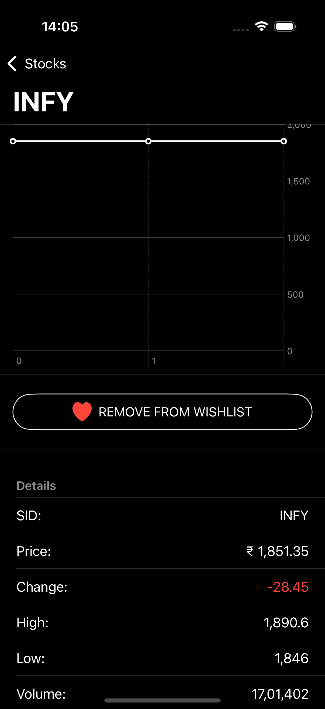

# Stocks

A real-time stock price tracking application built using **SwiftUI**, **Combine**, **SwiftData**, and **MVVM** architecture. The app fetches real-time stock price data from an external API and updates the UI every 5 seconds with the latest prices, showing price increases and decreases with appropriate icons.

### Home Screen

### WishList Screen

### Details Screen

## Features

- Display a **list of stocks** along with their current prices.
- Real-time stock price updates by **polling an external API** every 5 seconds.
- **SwiftUI** for building the UI, ensuring smooth, reactive user experience.
- **MVVM** architecture for a clean separation of concerns.
- **Combine** framework for handling real-time data streams and updates.
- Data is stored and managed using **SwiftData** for efficient local persistence.

## Architecture

### **MVVM (Model-View-ViewModel)**

- **Model**: Represents the stock data and network layer.
- **ViewModel**: Handles the logic for fetching stock data, formatting the data, and updating the UI.
- **View**: The user interface that binds to the ViewModel and updates in real-time.

### **Combine**

- Utilized to bind data from the **ViewModel** to the **View** in a declarative way.
- **Publishers** and **Subscribers** manage real-time updates every 5 seconds.

### **SwiftData**

- Used for efficient local data management and persistence.
  
## Data Sourcing

This app polls a stock price API every 5 seconds to fetch the most recent stock data. API used is static endpoint that returns fix number of results with varied data for polling.

